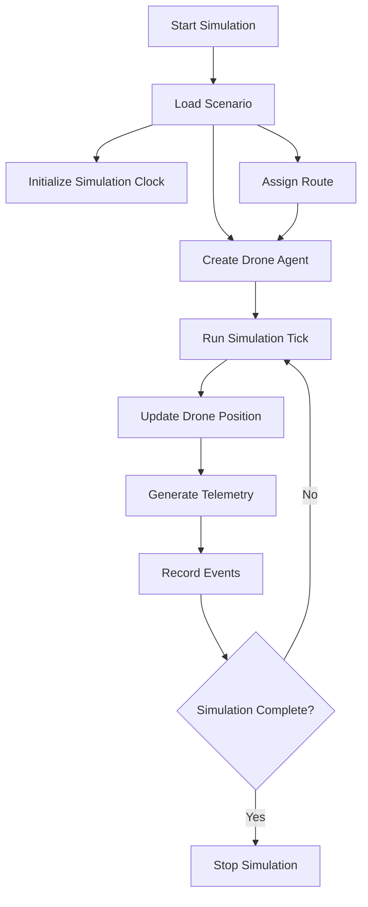

# SwarmNet Simulation Architecture

**Status:** Draft
**Last Updated:** 2026-07-02

---

## Purpose

This document defines the architecture of the SwarmNet simulation runtime.

The simulation runtime provides a deterministic environment for developing, testing, and demonstrating autonomous drone behavior before introducing real networking, real sensors, or real drone hardware.

---

## Simulation Goals

The simulation runtime should support:

- deterministic execution
- repeatable mission scenarios
- drone movement along routes
- telemetry generation
- hazard injection
- route replanning
- swarm deconfliction
- event replay
- future dashboard visualization

The initial implementation will focus on one drone moving along a predefined route.

---

## Core Concept: Simulation Tick

A simulation tick is one discrete step of simulated time.

The simulation should not depend directly on wall-clock time for core behavior. Instead, all simulation updates should advance according to the simulation clock.

Example:

```text
tick_duration_ms = 100
tick 0 = 0 ms simulated time
tick 1 = 100 ms simulated time
tick 2 = 200 ms simulated time
```

This allows the simulation to run faster than real time, slower than real time, paused, or step-by-step.

---

## Simulation Clock

The Simulation Clock owns simulated time.

Responsibilities:

- track current tick
- track simulated elapsed time
- define tick duration
- advance time deterministically
- provide timestamps for simulation events

Example model:

```text
SimulationClock
  current_tick
  tick_duration_ms
  elapsed_time_ms
```

---

## Tick Execution Order

Each simulation tick should execute in a consistent order.

Initial tick order:

```text
1. Advance simulation clock
2. Process scheduled commands
3. Process hazard injections
4. Update drone agent state
5. Run route-following logic
6. Run conflict checks
7. Generate telemetry
8. Record simulation events
9. Publish state updates
```

This order may evolve, but it should remain explicit and documented.

---

## Initial Runtime Components

| Component | Responsibility |
|---|---|
| Simulation Clock | Owns simulated time |
| Scenario Loader | Creates initial drones, missions, hazards, and routes |
| Drone Agent | Maintains drone state and executes assigned flight plan |
| Route Follower | Moves drone along the current route |
| Hazard Injector | Adds simulated hazards at configured ticks |
| Telemetry Publisher | Emits telemetry snapshots each tick |
| Event Recorder | Records important simulation events |

---

## Initial MVP Flow



---

## Drone Movement Model

The initial movement model should be intentionally simple.

A drone:

- has a current position
- has a target waypoint
- has a configured speed
- moves toward the target waypoint each tick
- advances to the next waypoint when it reaches the current target
- completes the route after the final waypoint

The first implementation can use a simplified Cartesian coordinate system instead of latitude/longitude.

Later versions may support geospatial coordinates, altitude, heading, acceleration, wind, and flight envelope constraints.

---

## Coordinate System

The MVP simulation should use a local 2D coordinate system.

Example:

```text
x_meters
y_meters
altitude_meters
```

This is simpler than using latitude and longitude for early algorithm development.

The Protobuf model already supports geographic coordinates. The simulation may later introduce conversion between local simulation coordinates and geographic coordinates.

---

## Telemetry Generation

Each tick should produce a telemetry snapshot for each drone.

Telemetry should include:

- drone id
- tick number
- simulated timestamp
- position
- velocity
- heading
- battery
- current waypoint
- current route
- execution status

For the first version, telemetry can be printed to stdout.

Later versions may publish telemetry to:

- NATS
- PostgreSQL
- dashboard WebSocket stream
- event log service

---

## Hazard Injection

Hazards may be introduced by scenario configuration or operator command.

Initial hazard injection model:

```text
At tick 50, create obstacle hazard at position (100, 100)
```

When a hazard appears, affected drones should eventually be able to:

- detect the hazard
- update local hazard state
- determine whether the current route is invalid
- request or perform route replanning
- publish a HazardDetected event
- publish a RouteReplanned event

Hazard-aware replanning is not required for the first simulation executable.

---

## Event Recording

The simulation should record meaningful events, not every internal calculation.

Examples:

- SimulationStarted
- MissionLoaded
- FlightPlanAssigned
- DronePositionUpdated
- WaypointReached
- RouteCompleted
- HazardInjected
- HazardDetected
- RouteInvalidated
- RouteReplanned
- SimulationCompleted

Events should eventually include:

- message id
- timestamp
- correlation id
- causation id
- source component
- payload

---

## Determinism Requirements

Given the same scenario file, random seed, and simulation configuration, the runtime should produce the same sequence of events.

This requires:

- simulation time instead of wall-clock time
- explicit random seed for randomized behavior
- stable tick execution order
- deterministic update rules
- repeatable scenario input

---

## Future Extensions

Future simulation capabilities may include:

- multiple drones
- drone-to-drone deconfliction
- dynamic hazards
- moving obstacles
- simulated sensor uncertainty
- communications latency
- packet loss
- disconnected drone agents
- battery drain
- route replanning
- probabilistic hazard confidence
- dashboard visualization
- event replay

---

## MVP Scope

The first simulation executable will include:

- one drone
- one predefined route
- one simulation clock
- deterministic tick loop
- route-following movement
- telemetry printed to stdout
- route completion detection

The first simulation executable will not include:

- NATS
- PostgreSQL
- dashboard
- real-time networking
- route replanning
- hazard avoidance
- multiple drones
