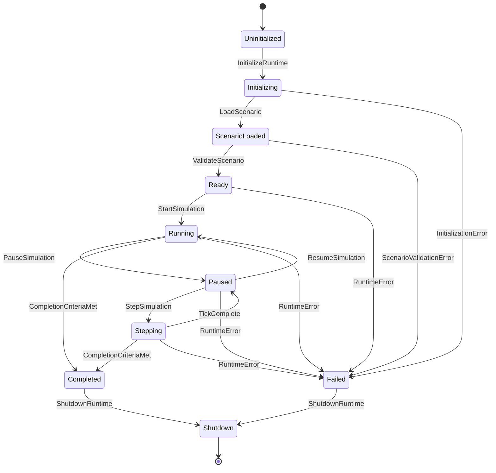

# SwarmNet Simulation Runtime Lifecycle

**Status:** Draft
**Last Updated:** 2026-07-02

---

## Purpose

This document defines the lifecycle states and state transitions for the SwarmNet simulation runtime.

The simulation runtime should behave as an explicit state machine rather than an uncontrolled execution loop. This makes the simulator easier to test, debug, pause, resume, step, and eventually control from the operator dashboard.

---

## Lifecycle States

| State | Meaning |
|---|---|
| `Uninitialized` | Runtime object exists, but no configuration or scenario has been loaded. |
| `Initializing` | Runtime is loading configuration and preparing internal components. |
| `ScenarioLoaded` | Scenario data has been loaded and validated. |
| `Ready` | Runtime is ready to begin simulation execution. |
| `Running` | Simulation ticks are advancing continuously. |
| `Paused` | Simulation state is preserved, but ticks are not advancing automatically. |
| `Stepping` | Runtime advances exactly one tick, then returns to `Paused`. |
| `Completed` | Simulation reached its normal completion criteria. |
| `Failed` | Runtime encountered an unrecoverable error. |
| `Shutdown` | Runtime has released resources and stopped execution. |

---

## Lifecycle Diagram



---

## State Definitions

## Uninitialized

The runtime object exists but has not loaded configuration, scenario data, drones, routes, or simulation settings.

Allowed transitions:

- `InitializeRuntime` → `Initializing`

Disallowed behavior:

- no ticks
- no telemetry
- no scenario access
- no drone updates

---

## Initializing

The runtime prepares internal dependencies.

Initialization may include:

- loading runtime configuration
- creating the simulation clock
- creating event recorder state
- preparing deterministic random seed
- preparing scenario loader
- preparing telemetry output sink

Allowed transitions:

- `LoadScenario` → `ScenarioLoaded`
- `InitializationError` → `Failed`

---

## ScenarioLoaded

A scenario has been loaded into memory but has not yet been validated for execution.

Scenario data may include:

- drones
- missions
- flight plans
- routes
- waypoints
- hazards
- simulation duration
- tick duration
- random seed

Allowed transitions:

- `ValidateScenario` → `Ready`
- `ScenarioValidationError` → `Failed`

---

## Ready

The scenario is valid and the runtime can begin execution.

The simulation clock is initialized but not yet advancing.

Allowed transitions:

- `StartSimulation` → `Running`
- `ShutdownRuntime` → `Shutdown`

---

## Running

The simulation clock advances continuously according to the configured execution mode.

Each tick follows the tick order defined in `simulation-architecture.md`.

Allowed transitions:

- `PauseSimulation` → `Paused`
- `CompletionCriteriaMet` → `Completed`
- `RuntimeError` → `Failed`

---

## Paused

The runtime preserves all simulation state but does not automatically advance ticks.

This state is useful for:

- debugging
- operator inspection
- manual stepping
- dashboard control
- deterministic scenario review

Allowed transitions:

- `ResumeSimulation` → `Running`
- `StepSimulation` → `Stepping`
- `ShutdownRuntime` → `Shutdown`
- `RuntimeError` → `Failed`

---

## Stepping

The runtime executes exactly one simulation tick.

After the tick completes, the runtime returns to `Paused` unless completion criteria are met.

Allowed transitions:

- `TickComplete` → `Paused`
- `CompletionCriteriaMet` → `Completed`
- `RuntimeError` → `Failed`

---

## Completed

The simulation has reached normal completion criteria.

Examples:

- all drones completed assigned routes
- mission completion criteria were satisfied
- configured maximum tick count was reached

Allowed transitions:

- `ShutdownRuntime` → `Shutdown`

---

## Failed

The runtime encountered an unrecoverable error.

Examples:

- invalid scenario
- impossible route
- corrupted runtime state
- missing drone assignment
- unhandled component error

Allowed transitions:

- `ShutdownRuntime` → `Shutdown`

---

## Shutdown

The runtime has stopped and released resources.

For the MVP, this may simply mean the executable exits.

Future versions may close:

- NATS connections
- database connections
- telemetry streams
- dashboard WebSocket connections

---

## Runtime Commands

| Command | Valid Source State | Target State |
|---|---|---|
| `InitializeRuntime` | `Uninitialized` | `Initializing` |
| `LoadScenario` | `Initializing` | `ScenarioLoaded` |
| `ValidateScenario` | `ScenarioLoaded` | `Ready` |
| `StartSimulation` | `Ready` | `Running` |
| `PauseSimulation` | `Running` | `Paused` |
| `ResumeSimulation` | `Paused` | `Running` |
| `StepSimulation` | `Paused` | `Stepping` |
| `TickComplete` | `Stepping` | `Paused` |
| `CompletionCriteriaMet` | `Running`, `Stepping` | `Completed` |
| `ShutdownRuntime` | `Ready`, `Paused`, `Completed`, `Failed` | `Shutdown` |

---

## Tick Execution in Running State

While in `Running`, the runtime repeatedly executes:

```text
1. Advance simulation clock
2. Process scheduled commands
3. Process hazard injections
4. Update drone agent state
5. Run route-following logic
6. Run conflict checks
7. Generate telemetry
8. Record simulation events
9. Publish state updates
10. Check completion criteria
```

---

## Tick Execution in Stepping State

While in `Stepping`, the runtime executes the same tick sequence exactly once.

After one tick:

- if completion criteria are met, transition to `Completed`
- otherwise transition back to `Paused`

---

## Completion Criteria

For the first MVP, completion occurs when:

- the single simulated drone reaches the final waypoint in its route

Future completion criteria may include:

- all drones complete their assigned flight plans
- mission objective coverage reaches required threshold
- operator aborts mission
- maximum simulation time is reached
- all drones land safely
- mission failure condition is reached

---

## Error Handling

Errors should cause explicit transitions to `Failed`.

The runtime should not silently continue after unrecoverable state errors.

Recoverable errors may be recorded as events while the simulation continues.

Examples of recoverable errors:

- temporary communications loss
- failed route replan attempt
- low-confidence hazard report
- delayed telemetry publication

Examples of unrecoverable errors:

- scenario has no drones
- assigned route has no waypoints
- drone has no flight plan
- invalid tick duration
- invalid initial state

---

## Determinism Requirements

The lifecycle state machine must support deterministic execution.

Given the same:

- scenario
- random seed
- tick duration
- runtime configuration

the simulator should produce the same:

- state transitions
- drone movement
- telemetry sequence
- event sequence

---

## MVP Implementation Notes

The first implementation should support:

- `Uninitialized`
- `Initializing`
- `Ready`
- `Running`
- `Completed`
- `Failed`
- `Shutdown`

The MVP may defer:

- `Paused`
- `Stepping`
- operator-issued runtime commands
- external scenario files
- dashboard control

However, the state machine should be designed so these states can be added without major restructuring.
